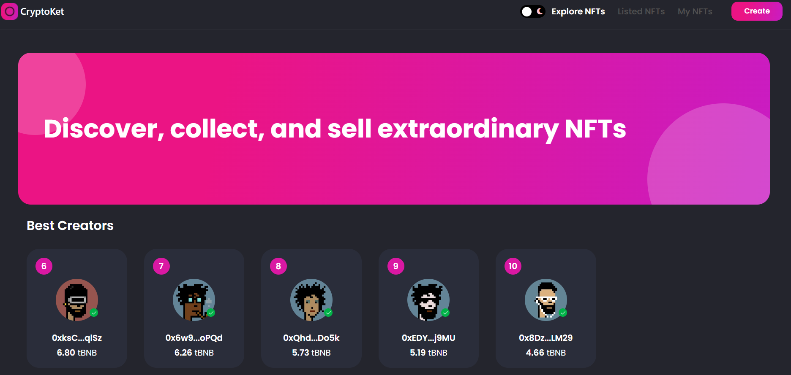

# CryptoKet NFT Marketplace

Welcome to the  NFT Marketplace repository! This repository contains the smart contracts and codebase Ethereum-based NFT marketplace where you can buy and sell non-fungible tokens.

## Features

- ERC-721 compliant NFT contracts.
- Create, list, and purchase NFTs.
- Built with Solidity for the smart contracts.
- Includes example usage scenarios and test cases.
- RainbowKit Wallet entegration.
- Optimized for gas efficiency.

## Getting Started

To get started with  NFT Marketplace, follow these steps:

1. Clone the repository to your local machine:
   ` git clone https://github.com/MhAliCakmak/NFTMarketplace.git`
2. Install all dependencies using npm or yarn (npm install / yarn)
   `cd NFTMarketplace
npm install`
3. Run Hardhat Network: `npx hardhat node`
4. Deploy Contracts: `npx hardhat run scripts/deploy.js --network localhost`
5. Compile & deploy contracts on Rinkeby network: `npx hardhat compile && npx hardhat run scripts/deploy
--network testnet`
6. You can then start developing your frontend! The deployed contract addresses will be in the console where you ran the server command.
7. Open another terminal window and start frontend server: `npm run dev`
8. Visit http://localhost:3000 in your browser
## Requirements
- Node.js v16.x
- Yarn 1.x
- A wallet that supports Ethereum (e.g., MetaMask)
- An account on a blockchain explorer like etherscan.io
## Usage
This project is built using NextJS as its framework, which allows you to easily create static pages and dynamic routes. The application uses React components throughout,
This project is an implementation of NextJS + HardHat stack for creating a simple NFT marketplace. It includes basic functionality such as listing,
This project is built using NextJS, HardHat, and React components. It uses the following libraries:
- @nomiclabs/hardhat-ethers canary: Provides an interface to interact with the EVM.
- @openzeppelin/contracts: Provides access to popular cryptographic standards and interfaces.
- chai: Allows us to write unit tests.
- ethereum-waffle: Provides tools for testing smart contracts.
- hardhat: The underlying tooling we use to build our app.
- pinata: Used to upload images to IPFS.
- react: Build user interface.

## Contribution
Contributions are always welcome! Please open up an issue first to discuss any major changes before submitting a pull request. If you're interested
Please make sure to read the [CONTRIBUTING](https://github.com/MhAliCakmak/NFTMarketplace)
document before making any pull requests.
We welcome contributions to improve Testbnb NFT Marketplace. If you'd like to contribute, please follow these steps:

1. Fork the repository.
2. Create a new branch for your feature or bug fix:
3. Make your changes. Ensure you include relevant documentation updates if necessary:``git checkout -b feature/new-feature``
4. Commit your changes:``git commit -m 'Add new feature'``
5. Push your branch to GitHub:``git push origin feature/new-feature``
6. Submit a pull request!
## License

This project is open source and available under the MIT License. See the [LICENSE](LICENSE) file for more details.

